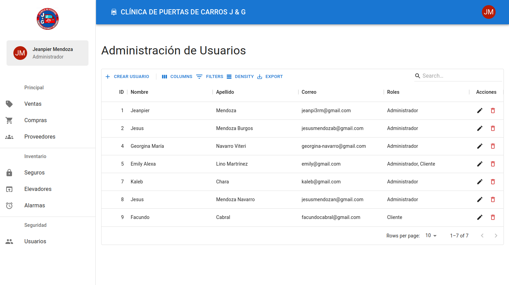

# Clínica de Puertas de Carros J & G - Management System (in development)

A management system to control sales, inventory and other aspects of the business. Currently in development.

## Technologies

- API (REST)
  - Java 17
  - Spring Boot 2.7.2
  - Spring Security (JWT implementation)
  - JPA / MySQL
- UI (SPA)
  - React ^18.2
  - TypeScript ^4.6
  - MUI (Material UI) ^5.10
  - Redux Toolkit (RTK) & RTK Query ^1.8.4
  - React Hook Form ^7.34
  - Vite ^3.0

## Screenshots

### Users administration (CRUD)

